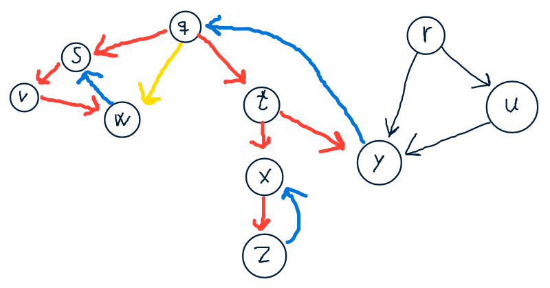
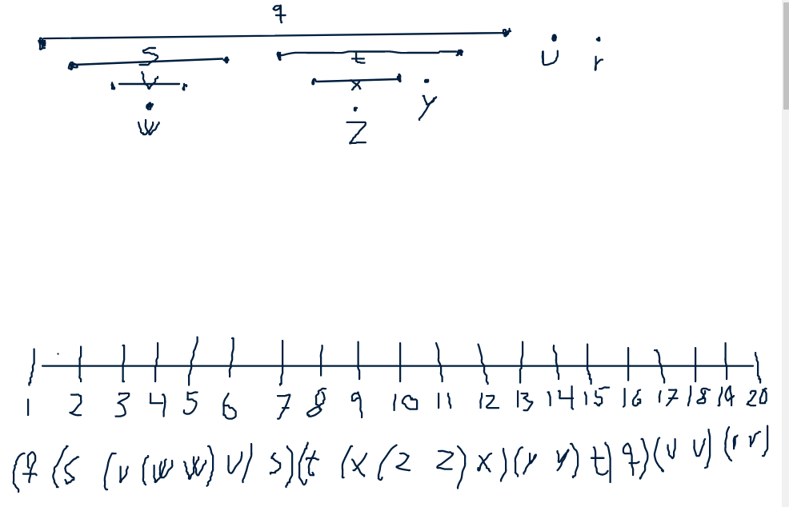
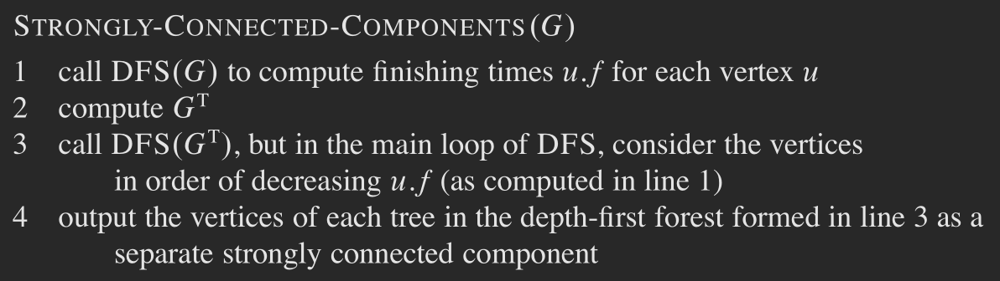
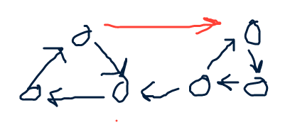
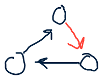
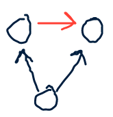

# Exercise Session 10
## Exercise 1
### Adjacency list
```
def transpose-adj(g)
    gt = new array of size g
    for v in gt
        v = []

    for i = 1 to g.len
        for j = 1 to g[i].len
            gt[j] = gt[j] ++ g[i]

    return gt
```
In total i think this should be $O(V + E)$, as the outer loop is all the vertices and the inner loop will add up to be all the edges.

```
def transpose-mat(g)
    gt = a new matrix of size g

    for i = 1 to g.len
        for j = 1 to g.len
            gt[j][i] = g[i][j]
```
This on should be $O(V^2)$.

## Exercise 2
```
def graph-diameter(g)
    ms = []
    for v in g
        // return distance to last white vertex as well
        [ds, d] = bfs(g, v)
        ms.push(d)
    return max(ms)
```
The run-time if bfs is $O(V+E)$ thus for this loop we get $O(V(V+E))$ Since there will always be at least as many vertices as there are edges we can write it as $O(v^2)$. The return statement will take $\Theta(V)$ time.

## Exercise 3
- Red is tree edge
- Blue is back edge
- Yellow is forward edge
- Black is cross edge


You can not sort it topologically because the graph is not acyclic $s \rightarrow v \rightarrow w \rightarrow s$.

## Exercise 4
```
def topologial-sort(g)
    gc = copy of g
    order = []
    while gc.size != 0
        for i = 1 to gc.size
            if gc[i].in == 0
                order = gc[i] ++ order
                semi-remove(g, i)
    return order

// other vertices will still point to it
def semi-remove(g, index)
    g.size -= 1

    for u in g[index]
        u.in -= 1

    //cut out the vertex
    g = g.sub(1, index) + g.sub(index + 1)
```
The run-time for should be $O(v^2)$ since we should always be able to remove one vertex from the graph in every time we are in the while loop. so it should always shrink by at least one.

It the graph is not acyclic it will go in a loop because we will reach a point where two or more vertices have made a SCC which means that `v.in` will always be bigger than zero.

## Exercise 5
Since it is acyclic it is going to be empty, but the algorithm for any graph can be found in the book.



## Exercise 6
We can remove one



We can add one



We can change nothing



I do not think that we are able to do anything other than those three things.
