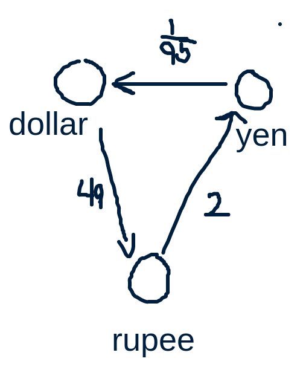

# Exercise Session 11
## Exercise 1
### A
Here we can make a reverse all the directions off edges in g or a copy of g. For This we can the algorithm from the last lecture.
```
def singleDestinationShortestPaths(g, t)
    gt = reverseAdjList(g)
    dijkstra(gt, t)
```
This should give a running time of $\Theta(mox(V^2, V + E))$

### B
```
def singlePairShortestPath(g, u, v)
    S = dijstra(g, u)
    return S[v].d
```
This should just be $\Theta(V^2)$.

### C
```
def allPairsShortestPath(g)
    ds = a new array of size g.v
    for i = 1 to g.v
        ds[i] = dijkstra(g, g[i])
```
The run-time for this is $\Theta(V^3)$.

## Exercise 2
I'll assume that a tree means that it has a root, and that directions will only be in one directions. Essentially we are representing a regular tree like a graph.
```
def treeDiameter(t)
    S = dijkstra(t, t.r)
    max(S.d)
```
Line one will be $\Theta(V^2)$ and line 2 will be $\Theta(V)$, thus we get $\Theta(V^2)$.

## Exercise 3
After Initialize-Single-Source(G, s) every $s$ has a distance of 0 and $s.\pi=null$ we only change if the condition $v.d > u.d + w(u,v)$. In this case we could write this as $0 > u.d + w(u,s)$. For this to be true it means that there is a path from $s \rightsquigarrow s$ which is lees than zero.

## Exercise 4
Sort of the last item in the queue will not be added to the completed list. But, since we have found the shortest path for every other element in the queue is done and will not change so this item can not affect the path of any other item. I think this stems from the fact that we always pick the easiest to reach vertex, thus the last will be the hardest to reach vertex, and therefore i will not make a path to any other vertex shorter.

## Exercise 5 $\star$
### A
Funnily enough we can think of this as a graph, but the edges are additive instead of multiplicative. You should be able to do this from the weighting function.



If we treat the graph as an unweigted graph we can find the SCC's of it. Then we can cycle trough each SCC and use the weighting function to see if it we end up we more money.

```
def moneyBaby(g, w)
    ts = SCC(g)
    for t in ts
        if cycle(t) > 0
            return true
    return false

    def cycle(t)
        res = 1
        for i = 1 to t
            res *= w(
```

Can not actually do this since it is not a directed graph

```
def moneyBaby(cs, rs)
    for i = 1 to rs.rows
        for j = 1 to rs.rows
            for k = 1 to rs.rows
                if i == j or j == j
                    continue
                if rs[i][j] * rs[j][k] * rs[k][i] > 1
                    return true
    return false
```
To print out these we can simply add i, j and k to an array or print them right when we find them. I do not no if this is actually correct. I worked of the principle that you should never need more than three jumps since you should be able jump over places where there is a fair exchange, or at least that it is in my head. Others have done this

[Solution 1](https://www.thealgorists.com/Algo/ShortestPaths/Arbitrage)

[Solution 2](https://anilpai.medium.com/currency-arbitrage-using-bellman-ford-algorithm-8938dcea56ea)
