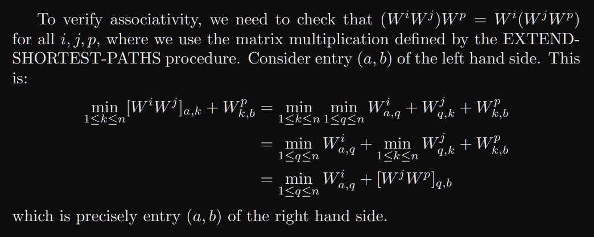

# Exercise Session 12
## Exercise 1



## Exercise 2
```
def faster_all_pairs_shortest_paths(W)
    n = W.rows
    L(1) = W
    m = 1
    while m < n - 1
        L(2m) is a now n x n matrix
        L(2m) = extend_shortest_paths(L(m), L(m))
        m = 2m

    L(2m) = extend_shortest_paths(L(m), L(m))
    for i = 1 to n
        for j = 1 to n
            if L(2m)[i][j] < L(m)[i][j]
                return Nothing
    return Just L(m)
```
Since we after $|V| - 1$ steps should have found the shortest paths they L should keep being the same unless there is a negative weight cycle which we can keep going trough.

## Exercise 3
```
def delete_keep_distance(G, v)
    for i = 1 to W.rows
        if G[i][v] != Null
            G[i][v] = Null
            for j = 1 to W.rows
                if G[v][j] == Null
                    G[i][j] = Null
                else
                    G[i][j] = G[i][v] + G[v][j]
   G' = keep the vertices we want from G and renumber
   return G'
```

## Exercise 4 $\star$
```
def adj_list_transitive_closure(G)
    out = a new array of size G.V
    in = a new array of size G.V

    for i = 1 to G.V
        for j = i.V
            if G[j] not in out[i]
                out[i].push(G[j])
            for v in in[i]
                if G[j] not in out[v]
                    out[v].push(G[j])
            in[j].push(G[i])

    return out
```
This should run in $O(n^4)$, but i have no idea if it will work.

```
def adj_list_transitive_closure(G)
    Sort G in topological order
    T = new list af size G.V
    for v in G (reverse topological order)
        for u in v
            T[v].insert(u)
            if v is not the last node
                T[v].insert(T[u])

```
I'll assume that insert does not insert duplicates and can do it in linear time, although you can probably do it in $lg(n)$ time. This should give the algorithm a running time of $O((V+E)V)$ or somthing similar.

## Exercise 5
For a we can use one of the previous algorithms to remove all D from G. We can then use floyd-warshall to find the all pairs shortest path.

We can again delete all D, then use single source shortest path on S which will give the shortest path from S to I and from S to J.
