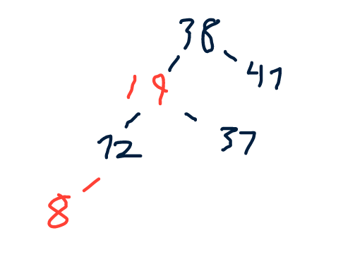
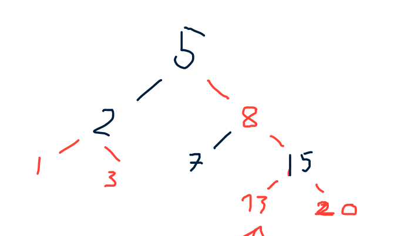
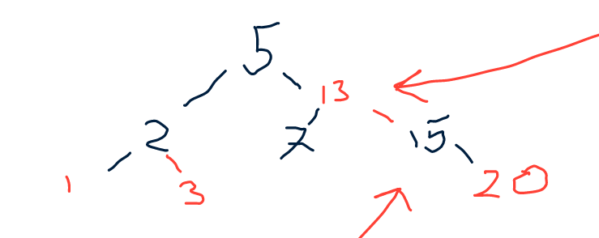

# Exercise Session 8
## Exercise 1
Implement a recursive variant of the TREE-INSERT procedure.
```
recTreeInstert(T, x, y, z)
    if x == null
        z.p = y
        if y == null
            T.root = z
        else if z.key < y.key
            y.left = z
        else
            y.right = z
    else
        if z.key < x.key
            recTreeInstert(T, x.left, x, z)
        else
            recTreeInstert(T, x.right, x, z)
```
Not quite sure if this is correct but it feels like it should be correct.

## Exercise 2
We can sort a sequence of $n$ numbers by iteratively inserting each number in a binary search tree and then performing an inorder tree walk. Write the pseudocode of this algorithm. What are the worst-case and worst-case running times for this sorting algorithm?
```
BSTSort(arr)
    T = new BST
    for x in arr
        TREE-INSERT(T, x)
    TREE-INORDER(T)
```
The best case is when the tree is balanced then TREE-INSERT will be $O(lgn)$ in the loop, thus we get that the best case is $O(nlgn)$. In the worst case the tree will be unbalanced this is the worst when the array is already sorted because then TREE-INSERT will me $\Theta(n)$, thus giving a worst case running time of $\Theta(n^2)$.

## Exercise 3
Consider the binary search tree T depicted in Figure 1. Delete the node with $key = 10$ from T by applying the procedure TREE-DELETE(T, x).

Did it in the note book, but that procedure is very confusing.

## Exercise 4
Show the red-black trees that result after successively inserting the keys 41, 38, 31, 12, 19 and 8, into an initially empty red-black tree.



## Exercise 5
Consider the red-black tree T depicted in Figure 3. Insert first a node with key = 15 in T, then delete the node with key = 8. Show all the intermediate transformation of the red-black tree with particular emphasis on the rotations.

### Insert


### Delete

