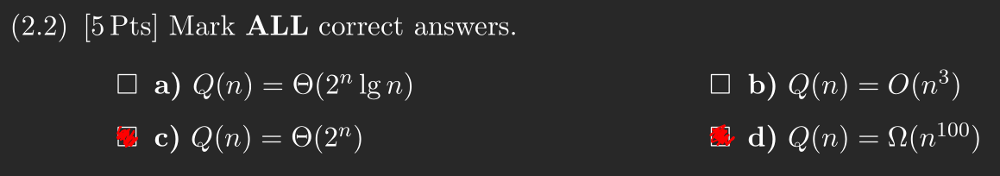

# Student information
- **Name:** Benjamin Clausen Bennetzen
- **Study number:** 20204861

# Question 1
In question d is questionable since we usually remove constants, when we write asymptotic notation.


# Question 2
## 2.1


## 2.2


## 2.3
Using the substitution method i have to prove that $T(n)=\Omega(2^n)$, i can do this by proving that $T(n) \geq c \cdot 2^n$, for all $n \geq n_0$.

I start with a base case of $n=0$. From the recurrence we have that $T(1) = d$, where $d$ is some real constant. We have that $c \cdot 2^0 = c$, thus our first constraint is that $d \geq c$.

Then for the inductive step we have:

$T(n) = n \cdot T(n - 1)$

By our inductive hypothesis we get.

$T(n) \geq n \cdot c \cdot 2^{n-1}$

I can set the lonely $n$ equal to a constant and know that the result we be lower, as the function should be increasing for large enough $n$.

$T(n) \geq 2 \cdot c \cdot 2^{n-1} = c \cdot 2^n$

Seeing as though i have reached the exact form i was looking for. I have proven that $T(n) = \Omega(2^n)$, as long as $c \leq d$.

# Question 3
## 3.1
In lecture 5 we were taught that `Quicksort` has its worst case running time of $O(n^2)$ when the partioning scheme produces one sub-problem such as with the case of `MaxQuicksort`.


## 3.2
1 is the right child of 3, which cannot be true for a binary tree, and 4 is bigger than its child 6, so it does not satisfy the max-heap property either.


## 3.3
Using linear probing i get the function $h(k,i) = k + i \text{ mod } 11$, and get the sequence $97, 55, 10, 14, nil, nil, nil, 29, 8, 75, 32$.

Using quadratic probing i get the function $h(k,i) = k + 2i + 4i^2 \text{ mod } 11$, and get the sequence $97, nil, nil, 14, nil, 10, 55, 29, 8, 75, 32$.

Using double hashing i get the function $h(k,i) = k + i(1 + (k \text{ mod } 10)) \text{ mod } 11$, and get the sequence $97, 10, nil, 14, nil, nil, 55, 29, 8, 75, 32$.


## 3.4
### 3.4.a


### 3.4.b


### 3.4.c


### 3.4.d
Since the G does not have any back edges it does admit a topological sorting. Calling `topological_sort{G)` returns the linked list `1->5->3->2->4->6`.

# Question 4
## 4.a
For this exercise i'll assume that `List-Insert` takes constant time. One way of doing this could be that lists are implemented as objects which keep track of the length of the list, thus we always know where to insert when we push an element into the list. With this assumption in mind we can continue with the analysis.

Assuming `for each` loops work like regular `for` loops we get.

```
RankedGroups(G, w, k)
    Let GK be an empty graph                // c1
    GK.V = G.V                              // C2
    for each u in G.V                       // c3 * |u| + 1
        let GK.Adj[i] be an empty list      // c4 * |u|
        for each v in G.Adj[i]              // c5 * |u| * |v| + 1
            if w(u,v) >= k                  // c6 * |u| * |v|
                List-Insert{GK.Adj[i],v)    // c7 * t
    Strongly-Connected-Components(GK)
```

From lecture 10 we that `Strongly-Connected-Components` runs in $\Theta(|V| + |E|)$ time.

Here $t$ represents the amount of times that line $6$ evaluates to true. Which in the worst case is $|u| * |v|$ times. This can again be shortened because what the algorithm is actually doing is to go through each edge from each vertex, this must be $|E|$ in total. Thus we get that line $3-7$ will end up being $O(|E|)$. Combining this with the run-time of `Strongly-Connected-Components` and the constant run-time for line $1-2$ we get that the total run-time is $O(|V| + |E|)$, as `Strongly-Connected-Components` will be the dominating factor.

## 4.b
For this exercise i will assume that the priority queue used in Dijkstra's algorithm implemented using an array giving `Dijkstra` a run-time of $\Theta(|V|^2)$, as seen in lecture 11.

Next i will assume that `T` is not a red-black tree so in the worst case this tree is not balanced. Which means that height of the tree will scale linearly with the amount of elements in the tree instead of logarithmeticly, which is not good as we in lecture were taught that the run-time for `Tree-Insert` is $\Theta(h)$. In this case it means that `Tree-Insert` is $O(|V|)$. This happens when `V` is sorted in either decreasing or increasing order of influence.

In lecture 8 we were also taught that `Inorder-Tree-Walk` was $\Theta(n)$, which in this case is $\Theta(|V|)$

Now the last thing to look at is line $5$ where we have a loop within a loop. We can see that we will loop through every vertex except for `s`, so this is $O(|V|)$ (not counting the outer loop). Line $6$ is within this doubly nested loop, but it takes constant time so is also $O(|V|)$ (again not counting the outer loop).

From this i can see that what going to be contributing the most is the fact that `Dijkstra` is run from within a loop that goes through all the vertices in `G`, which will add up to $O(|V|^3)$. Everything else will add up to lower terms so the total run-time is also $O(|V|^3)$.

# Question 5
## 5.a
The all pairs longest path problem is very similar to the all pairs shortest path problem. So i should be able reuse a lot from the algorithm we have used in the course to solve that problem. Specifically i will modify the Floyd-Warshall (introduced in lecture 12) to solve this problem. Therefore i will also make use of an adjencency-matrix.

The Floyd-Warshall algorithm recursively defines the value of the optimal solution by the fact that the shortest path from vertex $i$ to $j$ with intermediate vertex $k$ must consist of a shortest path from $i$ to $k$ and a shortest path from $k$ to $j$. In a similar fashion i defined the optimal solution as the maximal distance between $i$ and $j$ with intermediate vertex $k$ as the maximal distance between $i$ and $k$, and $k$ and $j$.

This means that i get a very similar recurrence to that of the normal recurrence for Floyd-Warshall, namely. (Could not get KaTeX to work properly with piece-wise function)

$d_{ij}^{(0)} = w_{ij} \text{, if } k = 0$

$d_{ij}^{(k)} = max(d_{ij}^{(k-1)}, d_{ik}^{(k-1)} + d_{kj}^{(k-1)}) \text{, if } k > 0$.

We can stop when $k=n$ as this when we have tried all different intermediate vertices. So as long as there is not a cycle (which there is not since G is acyclic) we can be sure that we have found the longest paths.

From the exercise i had to find $L$ using a bottom-up dynamic programming algorithm. I do this by finding $D^{(0)}, D^{(1)}, \dots, D^{(k)}$, where $D^{(k)}$ will represent $L$.

Implementing this in the Floyd-Warshall algorithm is quite easy, as only a single line has to be changed.

```
def max_floyd_warshall(W)
  n = W.rows
  D(0) = W
  for k = 1 to n
    let D(k) = (d(k)[i][j]) be a new n x n matrix
    for i = 1 to n
      for j = 1 to n
        d(k)[i][j] = max(d(k-1)[i][j], d(k-1)[i][k] + d(k-1)[k][j])
  return D(k)
```

## 5.b
I will assume that if i have used a adjencency-matrix in the last exercise i can replace `print_longest_path(G, w, i, j)` with `print_longest_path(W, i, j)`.

Just like the regular Floyd-Warshall algorithm i can in this version calculate a predecessor matrix $\Pi$. While i am computing $D^{(k)}$. Which is also a sequence of matrices like $D^{(k)}$. If i modify the recurrence for the predecessor matrix from lecture 12 to fit my purposes i get.

$\pi^{(k)}_{ij} = \pi^{(k)}_{ij} \text{, if } d_{ij}^{(k - 1)} > d_{ik}^{(k - 1)} + d_{kj}^{(k - 1)}$

$\pi^{(k)}_{ij} = \pi^{(k)}_{kj} \text{, if } d_{ij}^{(k - 1)} \leq d_{ik}^{(k - 1)} + d_{kj}^{(k - 1)}$

First i modify `max_floyd_warshall` to do this.

```
def max_floyd_warshall(W)
  n = W.rows
  D(0) = W
  let pi(0) be a new n x n matrix

  for i = 1 to n
    for j = 1 to n
      if -infinity < W[i][j] < infinity
        pi(0)[i][j] = i
      else
        pi(0)[i][j] = null

  for k = 1 to n
    let D(k) = (d(k)[i][j]) be a new n x n matrix
    for i = 1 to n
      for j = 1 to n
        if d(k-1)[i][j] > d(k-1)[i][k] + d(k-1)[k][j]
          d(k)[i][j] = d(k-1)[i][j]
          pi(k)[i][j] = pi(k-1)[i][j]
        else
          d(k)[i][j] = d(k-1)[i][k] + d(k-1)[k][j]
          pi(k)[i][j] = pi(k-1)[k][j]

  return (d(k), pi(k))
```

Now that i have the predecessor matrix i can print the maximal path recursively.

```
def print_longest_path(W, i, j)
    (_,pi) = max_floyd_warshall(W)
    print_longest_path'(pi, i, j)

def print_longest_path'(pi, i, j)
    if i == j
        print i
    else
        print_longest_path'(pi, i, p[i][j])
```
