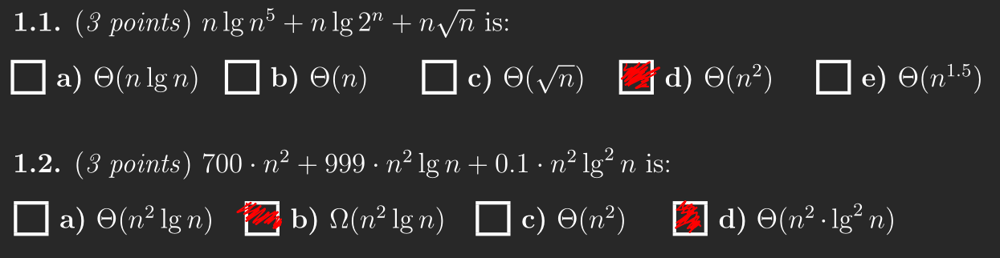
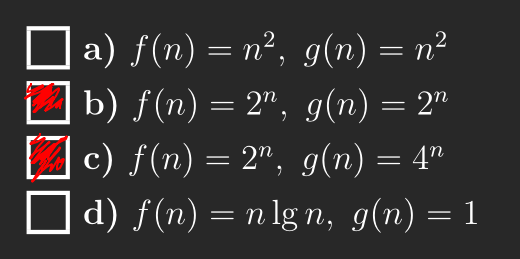
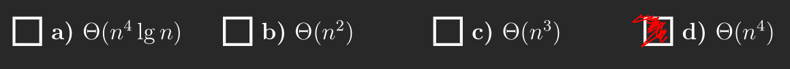
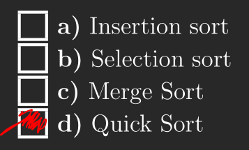
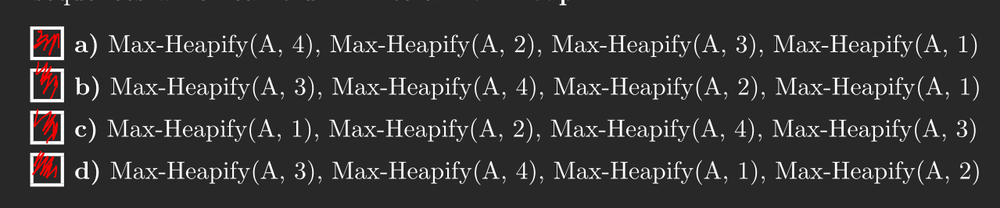
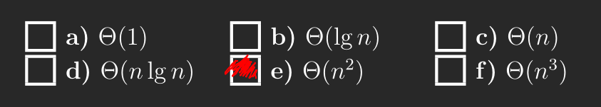
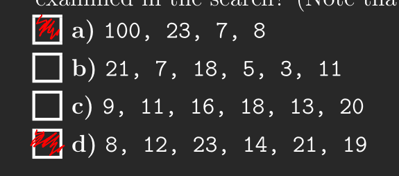

# Exercise 1
## 1.1


## 1.2


## 1.3


## 1.4


## 1.5


## 1.6


## 1.7
The correct should be `[_, 1, 10, 17, 13, 5, _, _, 9]`

## 1.8


# Exercise 2
## 2.1
We can represent each combination as i binary number. Given that there are five questions it would be 5-bit. Doing the questions ${Q_1,Q_3,Q_5}$ would be represented as $10101$. Since we are evaluating each combination and each combination has a unique binary representation we would need to evaluate $2^5 = 16$ cases, or $2^n$ given $n$ questions.

## 2.2
This can easily by restated as an instance of the knapsack problem. The main idea in the algorithm is to save results in an array `V[0..n][0..X]`. Saving the results saves us from recomputing a lot of values as per usual in dynamic programming. In the end we will have a value for `V[n][X]` which we can return.

The recurrence is as follows

$V(0,0) = 0$

$V(i,j) = V(i - 1, j), if t_i > j$

$V(i,j) = max(v_i + V(i - 1, j - t_i), V(i - 1, j)), otherwise$

```
def student_questions(v, t, X)
    n = v.length
    let V[0..n][0..X] be filled with 0's
    for i = 1 to n
        for  j ! 1 to X
            if t[i] > j
                V[i][j] = V[i - 1][j]
            else
                if V[i - 1][j] >= v[i] = v[i - 1][j - t[i]]
                    V[i][j] = v[i - 1][j]
                else
                    V[i][j] = v[i] + V[i - 1][i - t[i]]
    return V[n]X]
```

Due to the initialization of `V` and the double nested for loops we get a run-time of $\Theta(n \cdot X)$.

# Exercise 3
## 3.1
