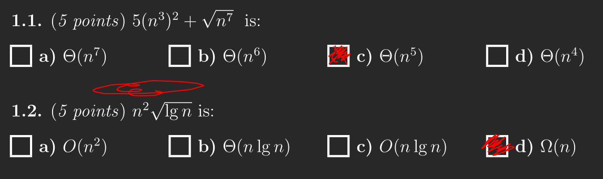
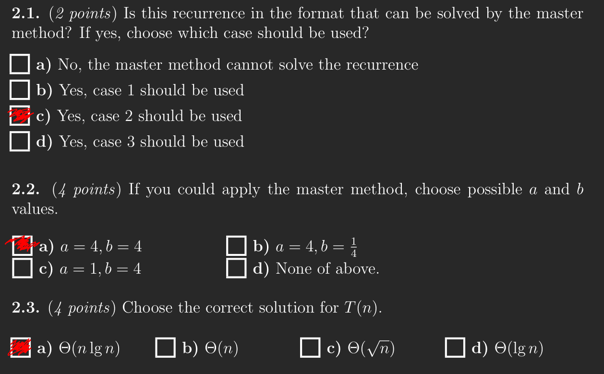
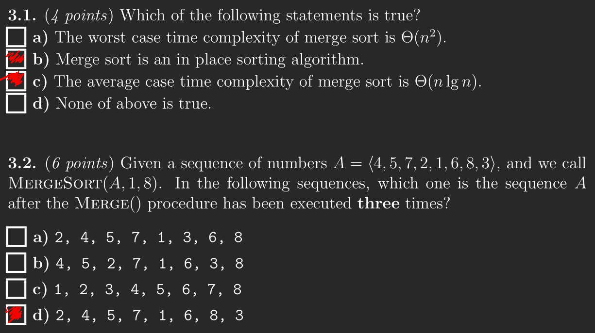
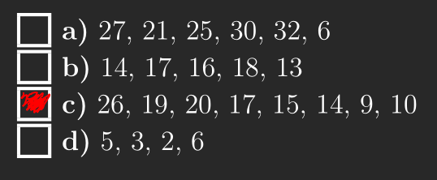
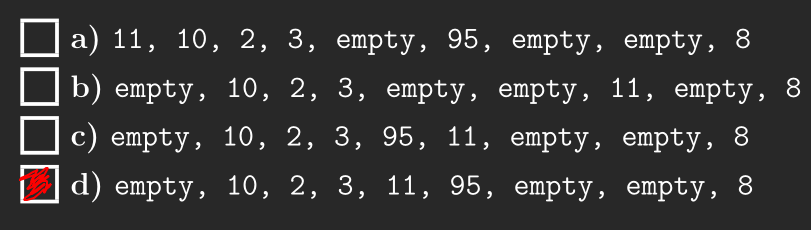
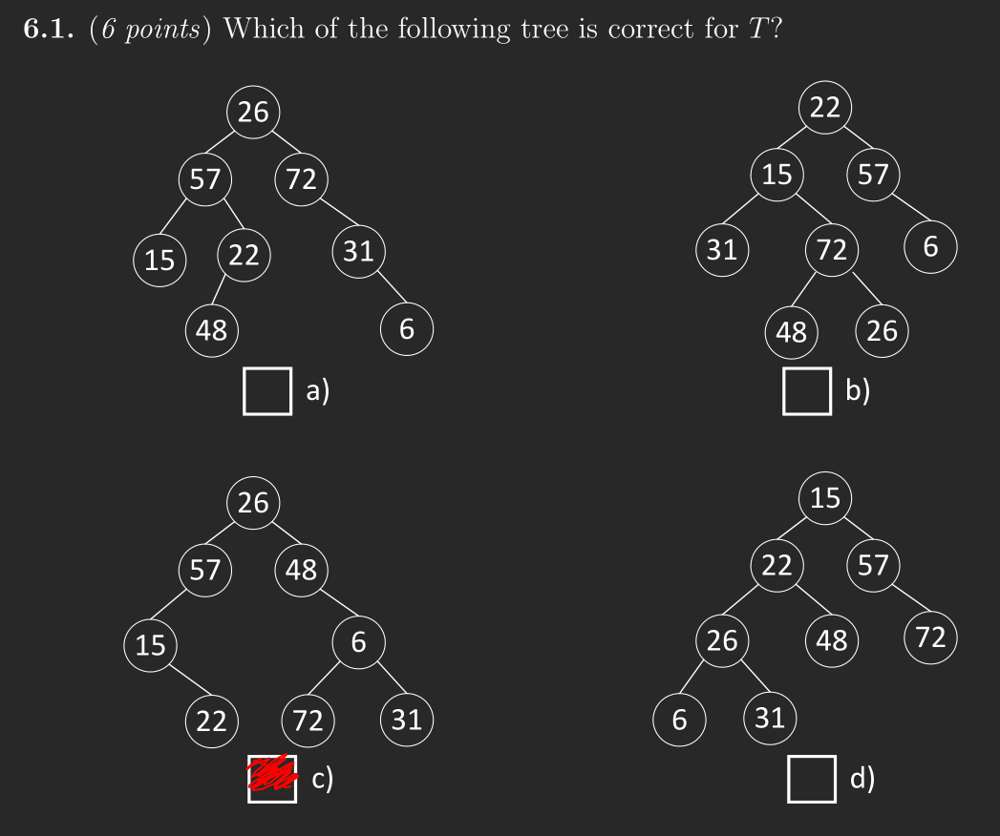
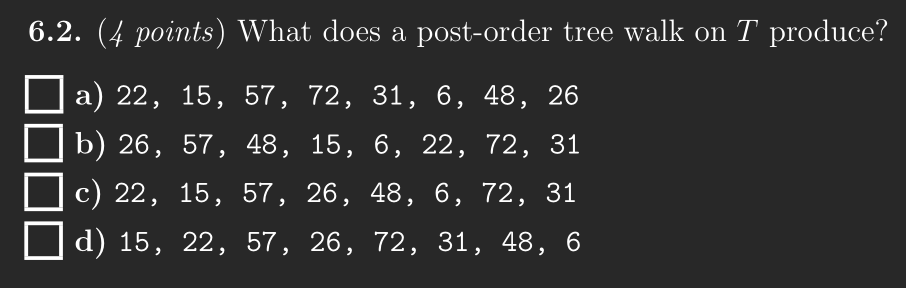

# Exercise 1
## 1.1


## 1.2


## 1.3


## 1.4


## 1.5


## 1.6




# Exercise 2
Given the assumption that the queue always has elements in it we do not have to worry about underflow when dequeing.

Since we are using a singly-linked-list we do not have to worry about overflow either.

I will assume that the queue implementation has the properties `q.head` and `q.tail` which will point to the head and the tail respectively.

Since we are working with pointers to to nodes in the linked list both of these operations can make use of the previously mentioned properties to get the desired nodes, so long as we update them when we are done.

```
def enqueue(q, n)
    q.tail.next = n
    q.tail = n

def dequeue(q)
    n = q.head
    q.head = q.head.next
    return n
```

# Exercise 3
First thing to do is to formalize the problem.

**Input:** An array of integers $[a_1, \dots, a_n]$

**Output:** An element $a$ such that  $a \leq a_i, 1 \leq i \leq n$.

## 3.1
Here we can use the same structure as merge sort, except our merge of values will be a little different.

```
def min_element(xs)
    return min_element'(xs, 1, xs.length)

def min_element'(xs, p, r)
    if p < r
        q = floor((p + r) / 2)
        m1 = min_element'(xs, p, q)
        m2 = min_element'(xs, q + 1, r)
        return if m1 < m2 then m1 else m2
    else
        return xs[p]
```

The algorithm works by halving the array just like merge sort. However, when we reach a sub-array of length 1 we return the element instead of doing nothing. Now when we merge we will have to find the least of the two sub-arrays.

## 3.2
Again we will see that it is very similar to merge sort. But, the combine step will be $\Theta(1)$ instead of $\Theta(n)$. We will get 2 sub-problems, and each sub-problem will have size $n/2$ relative to their parent problem.

$T(1) = \Theta(1)$

$T(n) = 2T(n/2) + \Theta(1)$


## 3.3
Since the recurrence is in the form $T(n) = aT(n/b) = f(n)$, we can solve it using the Theorem 4.1 in CLRS (the master theorem)

$a = 2, b = 2$

$n^{log_2(2)}=n^1=n$

Let say that $\epsilon = 1/2$

Then we can use case 1 since $\Theta(1) = O(n^{1/2})$.

Thus $T(n) = \Theta(n)$

## 3.4
When the problem gets bigger we will have to save more space as we will have to saves `m1`'s while calculating `m2`'s. Every time the input size doubles we will need to save another `m1`. In fact it uses $lg(n) + 1 = \Theta(lg(n))$ space.
