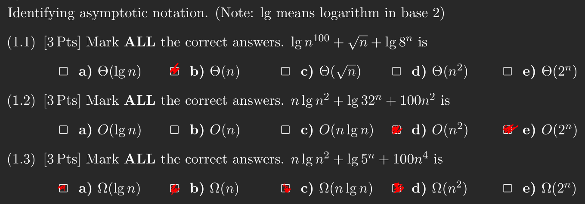
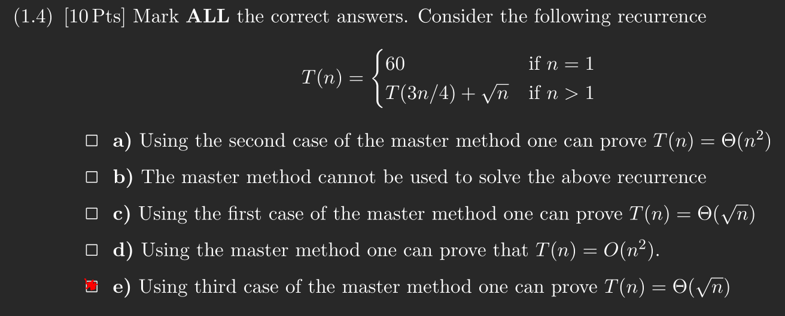
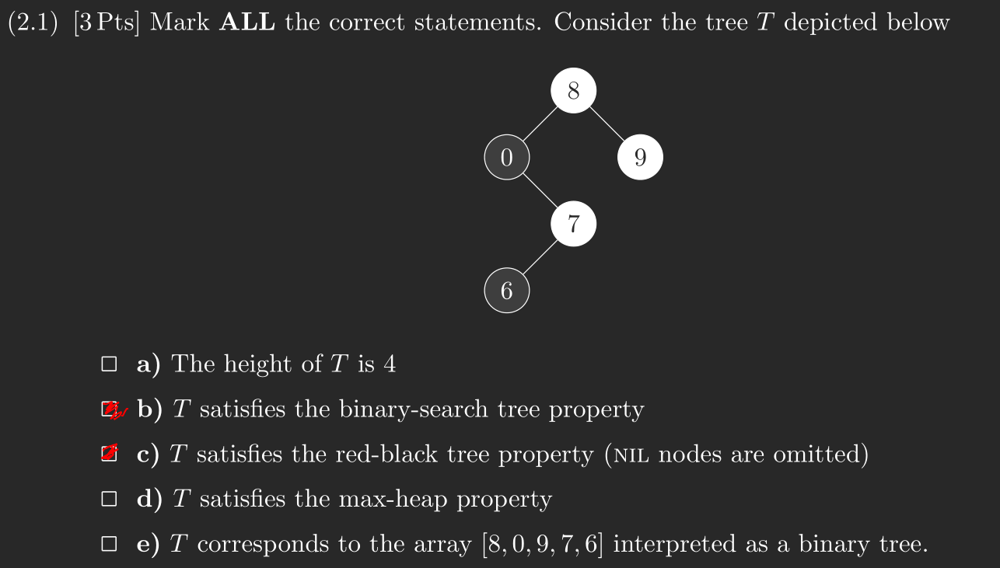
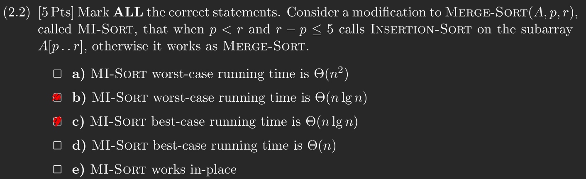
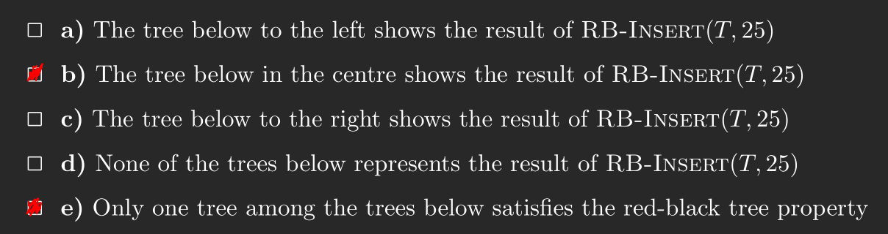
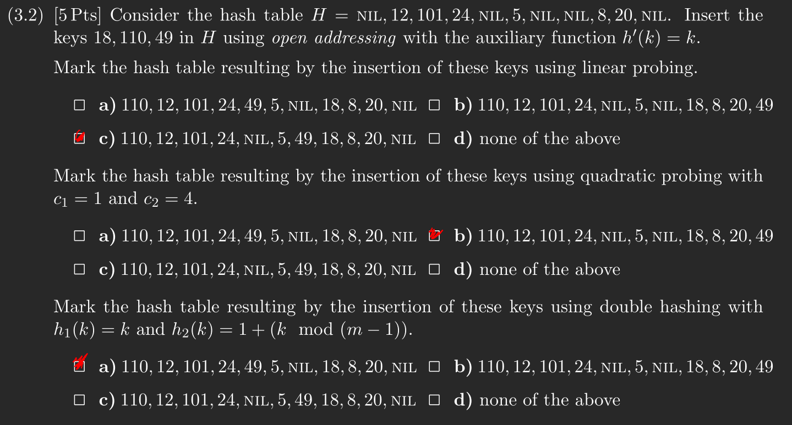
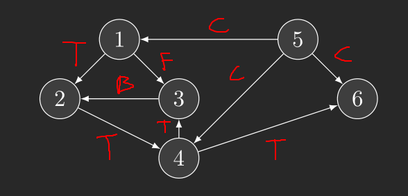
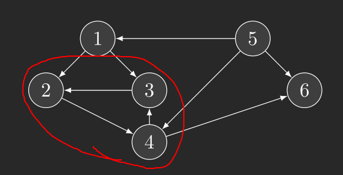

# Question 1




# Question 2
## 2.1


## 2.2


## 2.3
**(a):**

The algorithm is very similar to merge-sort, therefore the recurrence is going to look a lot like the one for merge-sort. Except we can combine solution in constant time.

$T(1) = \Theta(1)$

$T(n) = 2T(n/2) + \Theta(1)$

**(b):**

As the recurrence is in the form $T(n) = aT(n/b) + f(n)$ we can use theorem 4.1 from CLRS (the master theorem). We have the flowwing values: $a = 2, b = 2, f(n) = \Theta(1)$. Using case 1 we get that $\Theta(1) = O(n^{log_2(2)-\epsilon}) = O(n^{1 - \epsilon})$, which have has to be true for $\epsilon > 0$, thus $\epsilon = 1$ works and we have that, $T(n) = \Theta(n)$.

# Question 3
## 3.1


## 3.2


## 3.3
**(a):**

- 1: 1/10
- 2: 2/9
- 3: 4/5
- 4: 3/8
- 5: 11/12
- 6: 6/7

**(b):** (1 (2 (4 (3 3) (6 6) 4) 2) 1) (5 5)

**\(c\):**



**(d):**



# Question 4
In a bottom-up dynamic programming algorithm we want to start with a base case, that is problem that does not depend on any other sub-problems, and then save the result go to a bigger problem that depends on the saller problem that was just solved. In the end we should be able to solve the problem for size $L$.

```
def min_blocks(len, sizes)
    let l[0..len] be a new array filled with infinity
    l[0] = 0

    for i = 1 to len
        for s in sizes
            if i - s >= 0
                l[i] = min(l[i], 1 + l[i - s])

    return l[len]
```

The worst case running-time is $\Theta(L \cdot S)$ as they are the upper bounds in the nested for loops. Everything else is $\Theta(1)$, besides line 1 which is $\Theta(L)$.

# Question 5
## 5.1
As $w$ represents the distances between to vertices we can safly assume that no weighting will be negative. For this algorithm we will give each edge a property `h` which will be a tuple containing the hospital and the distance to that hospital. By calculating the single-source distances for each hospital we can find the shortest distance to the hospitals.

```
def nearest_hospital(G, w)
    for every vertex v in G
        v.h = (nulll, infinity)

    for h in G.H
        dijkstra(G, w, h)
        for every vertex v in G
            if v.d < v.h.snd    // get distance from the tuple
                v.h + (h, v.d)  // set the new hospital and distance
```

Assuming Dijkstra's is implemented using an array we get a worst case running time of $O(H \cdot V^2)$.

## 5.2
Since it a directed graph we can not just assume that we can pick a location for the firestation and then calculate the distance from the vertex containing the firestation to every other vertex, as we cannot be sure that we can go backwards. We can however, do this if we find $G^T$. Then we can calculate the all-pairs-shortest-path and find the placement which gives shortent mean distance.

For this we will be using an adjencency-matrix. With this we can compute the transpose in $\Theta(V^2)$ time, as we were taught in lecture 10. As we are using an adjencency-matrix the weights are already within the graph $G$. The entry being the weight from vertex i to j if the is a path and infinity otherwise.

```
def firestation(G)
    GT = transpose(G)
    D = floyd_warshall(G)
    firestation = (null, infinity)
    for i in G
        let current = (i, 0)
        for j in i
            current.snd += j
        current.snd /= G.length
        if current.snd < firestation.snd
            firestation = current
    return firestation
```

Seeing as transpose is $\Theta(V^2)$, `floyd_warshall` is $\Theta(V^3)$ and my own added code is $\Theta(V^2)$ the running time will be $\Theta(V^3)$.
