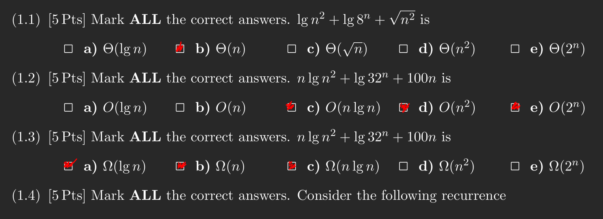
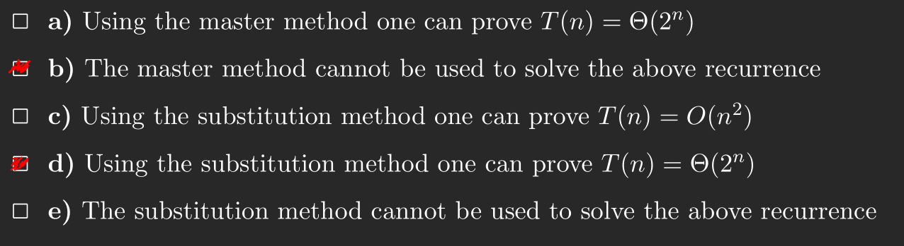
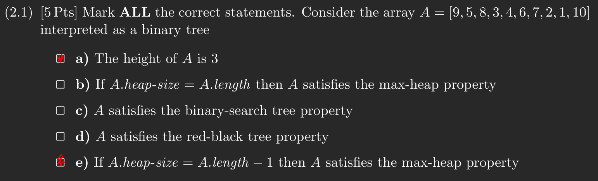
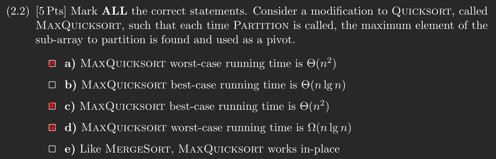
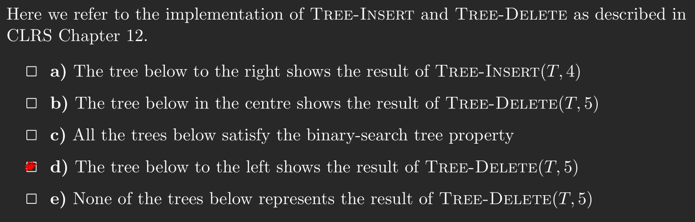
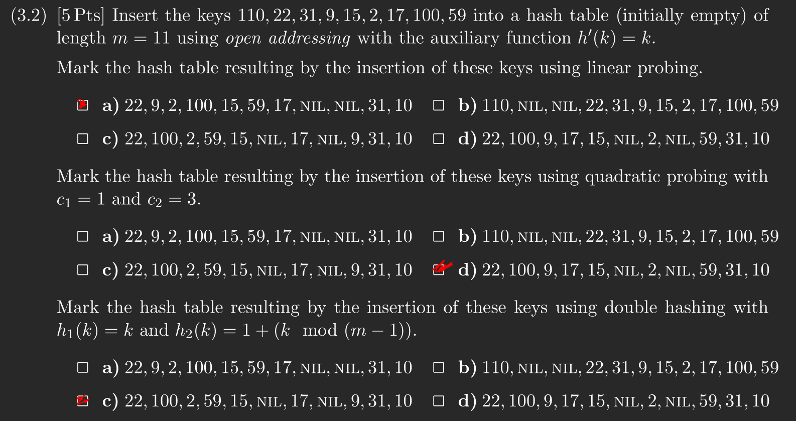

# Question 1




# Question 2
## 2.1


## 2.2


## 2.3
**(a):** Line 1-5 in `median` is just `heap-sort`, thus after line 5 the array `A` is sorted and returning `A[1]` will return the smallest number in `A`.

**(b):** In lecture 5 we were taught that `heap-sort` has a run-time of $O(n \cdot lg(n))$. Seeing as line 6 takes constant time, the same can be said here.

# Question 3
## 3.1


## 3.2


## 3.3
**(a):**
- 1: 1/10
- 2: 2/9
- 3: 4/5
- 4: 3/8
- 5: 11/12
- 6: 6/7

**(b):** (1 (2 (4 (3 3) (6 6) 4) 2) 1) (5 5)

**\(c\):**
- Tree: $\{(1,2), (2,4), (4,3), (4,6)\}$
- Back: $\{\}$
- Forward: $\{(1,3)\}$
- Cross: $\{(5,4),(5,6)\}$

**(d):** As G is a DAG there exits a topological probably more. On of them will be $1,5,2,4,3,6$.

# Question 4
## 4.1
For this exercise i will assume that we we have a directed graph G represented as adjacency-matrix. If we get the pair $(a_i,b_i)$ then $G_{s_{a_i}s_{b_i}}=1$ and $0$ otherwise.

With this graph we can simply count the number of friendships. We can see each pairing i and j as a square and compute the total number of friends in that square using the previous square added together with the sides added below and above. Each of these sides will have a length of $j - i$ thus we only need to recompute $2(j - i) - 1$.

```
def count_friendships(G)
    let T[1..n][1..n] be a new array
    for i = 1 to n
        T[i][i] = G[i][i]
        for j = i + 1 to n
            T[i][j] = T[i][j - 1] + count_friendships'(G, i, j)
    return T

def count_friendships'(G, i, j)
    counter = 0
    for let k = i to j
        if k == j
            counter += G[j][j]
        else
            counter += G[k][j] + G[j][k]
    return counter
```

Due to the triply-nested for loops the run-time will be $O(n^3)$, where $n$ is the total number of students.

## 4.2
We should be able to reframe this as a knapsack problem. I want to maximize the amount of friendships i.e value, within the limitation that i only have

# Question 5
## 5.1
We can utilize the fact that `BFS` runs in time $O(V + E)$ and keeps track of distance. We can simply keep track of the distance such that if it over goes above 6 we return false. We can do this because when we discover a vertex in `BFS` it is via the shortest path to it. Thus the modified version looks like the following.

```
def bacon(G,s)
    for each vertex u in G.v \{s}
        u.color = white
        u.d = infinity
        u.p = null
    s.color = gray
    s.d = 0
    s.p = null
    Q is a new empty queue
    enqueue(Q,s)
    while Q is not empty
        u = dequeue(Q)
        for each v in G.Adj[i]
            if v.color == white
                v.color == grey
                v.d = u.d + 1
                if v.d > 6
                    return false
                v.p = u
                enqueue(Q,v)
            u.color = black
    return true
```

## 5.2
Seeing as though edge weights are non negative a suitable algorithm would be Dijkstra's algorithm. Once we have the last vertex everything has already been relaxed all that it can be, thus the last vertex will have the longest distance.

```
def dijkstra'(G,w,s)
    initialize_single_source(G,s)
    S = empty
    Q = G.V
    while Q is not empty
        u = extract_min(Q)

        // find the maximal worst collab
        if Q is empty
            longest = u.d

        S = S union U
        for each vertex v in G.adj[i]
            relax(u,v,w)

    return longest
```
